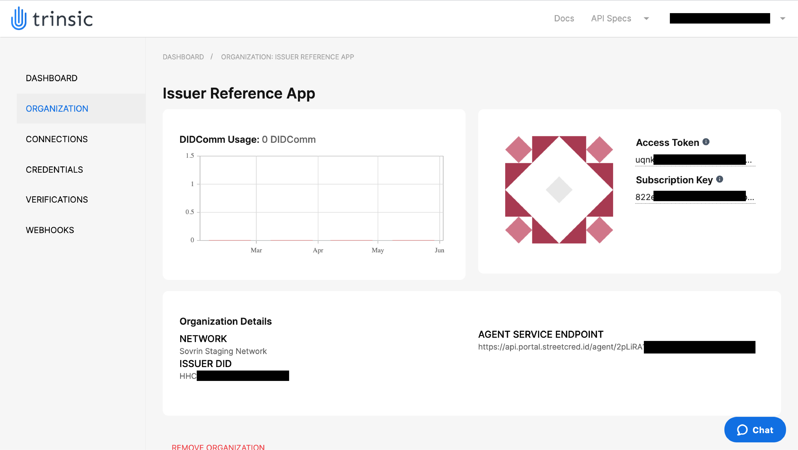
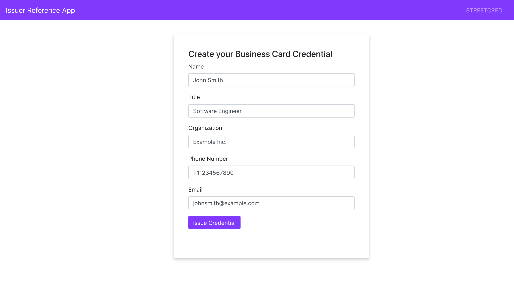
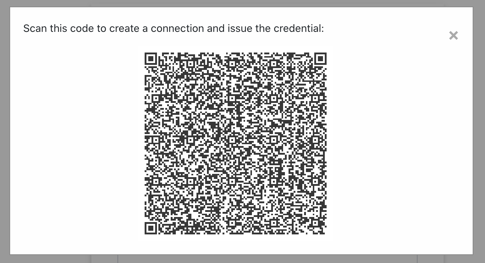

# Streetcred's API Quickstart
This demo shows how to add Streetcred API calls into a nodejs app with our service client. It also shows a webhook implementation can create automated workflows in your app. 

## Use Case
In this simple use case, you control a (very simple) issuer portal for your organization, which can issue a business card to anyone with a mobile wallet in your organization. Once a business card is issued, that holder can do business card verifications to other peers using the Streetcred mobile app. 

## Prerequisites:
- [npm](https://www.npmjs.com/get-npm)

## Install mobile wallet

 1. Download the [Android](https://play.google.com/store/apps/details?id=id.streetcred.apps.mobile) or [iOS](https://apps.apple.com/us/app/streetcred-identity-agent/id1475160728) Streetcred Identity Wallet.

## Steps to issue a business card: 

### Prepare issuer portal
 1. Clone the repository
 `git clone https://github.com/streetcred-id/iiw-demo`
 
 2. Navigate into the directory
 `cd iiw-demo`
 
 3. Install the dependencies
 `npm install .`

 4. Open up the repository in a code editor of your choice

 5. Rename the .env-template file to .env

 6. Go to the Streetcred <a href="https://developer.streetcred.id" target="_blank">developer portal</a> and create an account

### Register your organization
 1. Create a new organization and select the Sovrin Staging Network.
 
 2. In the .env file, add your organization's subscription key to the `SUBKEY` field and the access token to the `ACCESSTOK` field.
    
### Create a credential definition with Swaggerhub
 1. Retrieve your organization's Access Token and Subscription Key on the Organization page

    

 2. Navigate to the <a href="https://app.swaggerhub.com/apis-docs/Streetcred/agency/v1#/Definitions/CreateCredentialDefinitionForSchemaId" target="_blank">`POST /definitions/credentials/{SchemaId}` </a>endpoint
 3. Click the lock button on the right-hand side of the endpoint description and authorize Swaggerhub by pasting "Bearer " + your access token in the `accessToken` field, your subscription key in the `subscriptionKey` field, and clicking authorize for each field
     * i.e. If the access token is `123456789`, then enter it as `Bearer 123456789`
 4. Close the authorization modal, and click the `Try it out` button to prepare the API call to write the credential definition to the ledger
 5. In the .env file, find the ledger you're using and remove the `#` from before that SCHEMA_ID line
 6. Copy that schema ID into the `schema_id` field in Swaggerhub

    

 7. Click "execute" and after a couple seconds you will see "curl", "request URL", and "server response".  Copy the `definitionId` value from the "server response" section and add it to your .env file for the CRED_DEF_ID value

    

 8. If you get a 504 Gateway Timeout error, go to the [GET /definitions/credentials](https://app.swaggerhub.com/apis-docs/Streetcred/agency/v1#/Definitions/ListCredentialDefinitions) endpoint, click `try it out` and then `execute` to get your newly minted credential definition
 
### Running the application
After defining the credential, you are ready to run the application. 

- Run with npm
`npm run start`

- On the web app, fill in the details and click issue credential

    

- If you're using the Streetcred Wallet, make sure your agent is configured to the Sovrin Staging network (upper-left on the home tab)

- Scan the QR with your mobile wallet

    

This is a connection invitation. Webhooks will automatically issue you a credential once this is scanned

- Accept the credential offer

- Receive a business card! 

- If you are on iOS, you can also use the Streetcred Identity Agent to connect with others and send verified email and phone number between each other

> Contact <support@streetcred.com> for any questions. 

 
