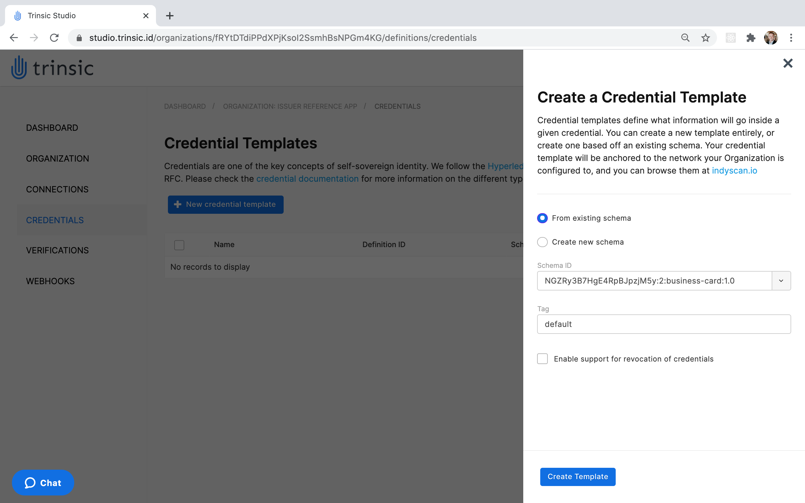

# Trinsic's Issuer Reference App
This demo shows how to add Trinsic Credentials API calls into a nodejs app with our service client.
It also shows a webhook implementation can create automated workflows in your app. 

## Use Case
In this simple use case, you control a (very simple) issuer portal for your organization, which can issue a business card to anyone with a mobile wallet in your organization.
Once a business card is issued, that holder can do business card verifications to other peers using the Trinsic Wallet app. 

## Prerequisites:
- [npm](https://www.npmjs.com/get-npm)

## Install mobile wallet

1. Download the [Android](https://play.google.com/store/apps/details?id=id.streetcred.apps.mobile) or [iOS](https://apps.apple.com/us/app/trinsic-wallet/id1475160728) Trinsic Wallet.

## Steps to issue a business card: 

### Prepare issuer portal
1. Clone the repository
`git clone https://github.com/trinsic-id/issuer-reference-app`
2. Navigate into the directory
`cd issuer-reference-app`
3. Install the dependencies
`npm install`
4. Open up the repository in a code editor of your choice
5. Rename the .env-template file to .env
6. Go to <a href="https://studio.trinsic.id" target="_blank">Trinsic Studio</a> and create an account

### Register your organization
1. Create a new organization and select the Sovrin Staging Network.
2. Click on the details button associated with the new organization to open the organization details tab.

3. In the .env file, add your organization's access token to the `ACCESSTOK` field.
    
### Create a credential definition
1. Click on the new organization to enter its dashbaord.
2. Click on the **CREDENTIALS** button on the left side of the screen to open the credentials tab.
3. Click on the **Create Template** button and select the **New Schema** option.
4. Name the template "Business Card".
5. Enter the following attributes
    - Full Name
    - Title
    - Company Name
    - Phone Number
    - Email
  
    
6. Click **Continue to Review** then **Confirm**.
7. Copy the **Credential Template ID** to the `.env` file under `Credential Definition`
8. Click on the information icon next to the credential definition.
9. Copy the **Schema ID** to the `.env` file under `Sovrin Staging Schema`
 
### Running the application
After defining the credential, you are ready to run the application. 

1. Run with npm
`npm start`
2. On the web app, fill in the details and click issue credential.

3. Make sure your agent is configured to the Sovrin Staging network (upper-left on the home tab).
4. Scan the QR with your mobile wallet.

This is a connection invitation.
Webhooks will automatically issue you a credential once this is scanned and the connection is accepted.

Then, simply accept the credential offer and receive a business card! 

> Contact <support@trinsic.com> for any questions. 

